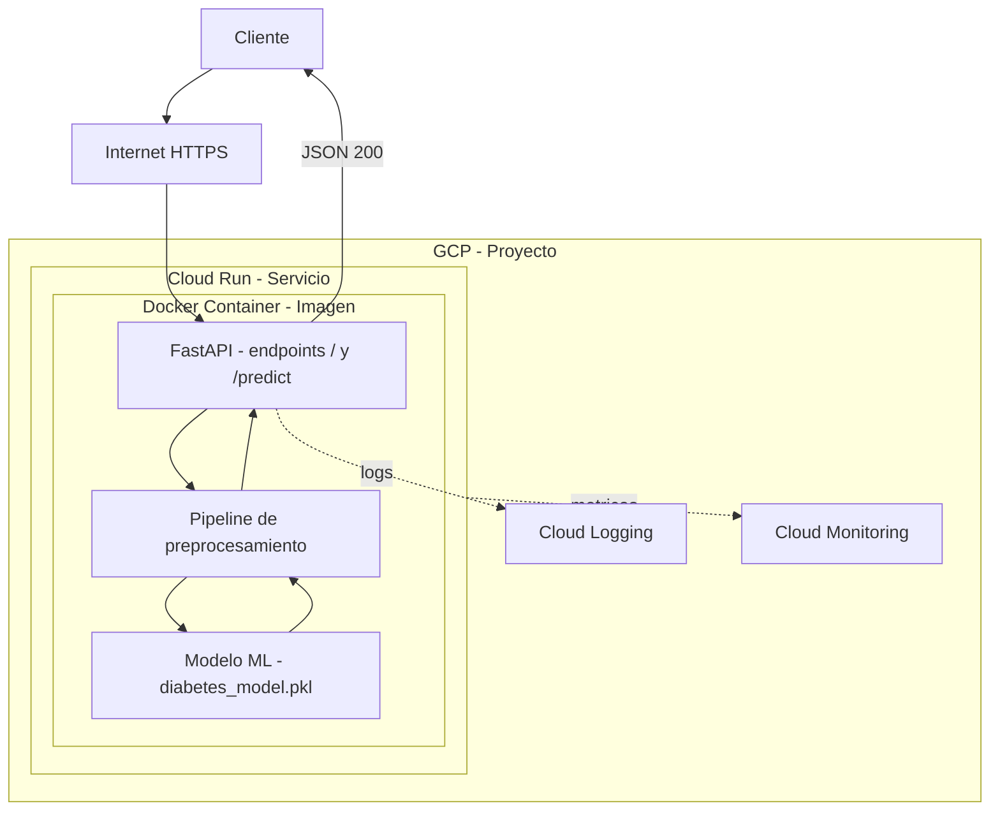

**Modelo de clasificación para detección de diabetes (multiclase) empaquetado en Docker y desplegado en Google Cloud Run con una API FastAPI.**
________________________________________
**1) Descripción general**
Este repositorio contiene:

●       Un modelo ML serializado (diabetes_model.pkl).

●       Una API en FastAPI (app.py) que expone endpoints para predicción.

●      Artefactos de infraestructura para despliegue: Dockerfile, requirements.txt y archivos opcionales de plataformas (p.ej. Procfile, runtime.txt).

●       Pruebas básicas en test.py.

**Arquitectura (alto nivel)**: 
Cliente → 2. FastAPI (/predict) → 3. Pipeline de preprocesamiento → 4. Modelo (.pkl) → 5. Respuesta JSON.

_______________________________________
**2) Estructura del repositorio**

├── app.py            	# API FastAPI (endpoints / y /predict)

├── diabetes_model.pkl	# Modelo entrenado serializado

├── requirements.txt  	# Dependencias de Python

├── Dockerfile        	# Receta para la imagen que se construye con Cloud Build y se despliega en Cloud Run.

├── test.py           	# Pruebas básicas de API/modelo

├── runtime.txt       	# (Opc.) Compat. Heroku

├── Procfile          	# (Opc.) Compat. Heroku

├── LICENSE           	# Licencia MIT

└── README.md         	# Documentación del proyecto
 
________________________________________
**3) Cómo ejecutar localmente**

**3.1. Python (venv)**

python -m venv .venv

source .venv/bin/activate   # En Windows: .venv\\Scripts\\activate

pip install -r requirements.txt

uvicorn app:app --host 0.0.0.0 --port 8000 --reload

Visita: http://localhost:8000/docs.

**3.2. Docker**

docker build -t diabetes-api:latest .

docker run -p 8000:8080 diabetes-api:latest

Abre http://localhost:8000/docs.

Nota: Ajusta el puerto si tu app.py/Dockerfile usa otro (p.ej. PORT de entorno).

________________________________________
**4) Uso de la API**

La API expone dos endpoints principales:

**4.1. GET /**

Descripción: healthcheck simple.
  Respuesta 200:
{ "message": "Prediction" }

**4.2. GET /predict**

Descripción: devuelve la clase de diabetes y probabilidades por clase.

**Parámetros (query):**

●       **Gender (integer):** Sexo biológico del individuo. Usualmente codificado como: 0 = Femenino, 1 = Masculino. El género puede influir en el riesgo de diabetes debido a diferencias hormonales y de estilo de vida.

●       **AGE (integer):** Edad del sujeto en años. La edad es un factor de riesgo crítico, ya que el riesgo de diabetes aumenta con la edad, especialmente después de los 45 años.

●       **Urea (float):** Medición de la urea (en mg/dL) en la sangre. Niveles altos pueden indicar problemas renales, los cuales son complicaciones comunes de la diabetes. Rango normal: ~7–20 mg/dL.

●       **Cr (integer):** Mide el nivel de creatinina en la sangre (mg/dL). También es un marcador de la función renal. Niveles elevados de creatinina pueden sugerir una función renal deteriorada, a menudo asociada con diabetes. Rango normal: ~0.6–1.3 mg/dL.

●       **HbA1c (float):** Indicador clave del promedio de los niveles de glucosa en sangre durante los últimos 2–3 meses. Se expresa como porcentaje. - Normal: <5.7% - Prediabetes: 5.7–6.4% - Diabetes: ≥6.5%

●       **Chol (float):** Colesterol total en la sangre (mg/dL). El colesterol alto es un factor de riesgo para enfermedades cardiovasculares, común en personas con diabetes. Normal: <200 mg/dL.

●       **TG (float):** Mide la cantidad de grasa en la sangre (mg/dL). Niveles altos se asocian con resistencia a la insulina y síndrome metabólico. Normal: <150 mg/dL.

●       **HDL (float):** El “colesterol bueno” (mg/dL). Niveles más altos son mejores. Ayuda a eliminar el exceso de colesterol del torrente sanguíneo. - Ideal: >40 mg/dL (hombres), >50 mg/dL (mujeres).

●       **LDL (float):** El “colesterol malo” (mg/dL). Niveles altos contribuyen a la acumulación de placa en las arterias. Óptimo: <100 mg/dL.

●       **VLDL (float):** Otro tipo de “colesterol malo” (mg/dL), transporta triglicéridos. A menudo se estima como TG/5. Un VLDL alto se asocia con mayor riesgo de diabetes. Normal: 2–30 mg/dL.

●       **BMI (integer):** Medida de grasa corporal basada en peso y altura (kg/m²). La obesidad (IMC ≥30) es un factor de riesgo importante para la diabetes tipo 2. - Bajo peso: <18.5 - Normal: 18.5–24.9 - Sobrepeso: 25–29.9 - Obeso: ≥30.

**Nota:** En Swagger, todos aparecen como parámetros de query (no se envía cuerpo JSON).

**Ejemplo de parámetros de ejecución (Python):**

params = {
    "Gender": 0, "AGE": 50, "Urea": 4.7, "Cr": 46,
    "HbA1c": 4.9, "Chol": 4.2, "TG": 0.9, "HDL": 2.4,
    "LDL": 1.4, "VLDL":0.5, "BMI": 24
}

print(requests.get(f"{base}/predict", params=params, timeout=30).json())

**Respuesta 200 (ejemplo):**

{
  "class_id": 0,
  "class_name": "Non-Diabetic",
  "message": "Non-diabetic. No worries :)",
  "probabilities": {
    "Non-Diabetic": 0.8557909684301778,
    "Diabetic": 0.05683807414989791,
    "Prediabetic": 0.08737095741992443
  }
}

**Errores comunes:**
422 Validation Error: falta un parámetro o el tipo no coincide (entero vs decimal).
________________________________________
**5) Datos y Modelo (Model Card)**

**Problema:** Clasificación multiclase (Non-Diabetic, Prediabetic, Diabetic).

**Clases objetivo:** 0 = No diabético, 1 = Diabético, 2 = Prediabético.

**Variables usadas (11 features):** Gender, AGE, Urea, Cr, HbA1c, Chol, TG, HDL, LDL, VLDL, BMI.

**Conjunto de datos:** El conjunto de datos utilizado proviene de Mendeley Data (Ahlam Rashid, 2020), bajo el título Diabetes Dataset (DOI: 10.17632/wj9rwkp9c2.1), y contiene 1.000 registros de pacientes, cada uno con múltiples variables clínicas y demográficas. Los datos fueron recopilados en el Medical City Hospital y en el Specialized Center for Endocrinology and Diabetes – Al-Kindy Teaching Hospital (Irak)

**Preprocesamiento:** En la etapa de preprocesamiento no se realizaron imputaciones de valores faltantes, dado que todas las variables presentaban valores válidos. Además, considerando que todas las variables son numéricas, no fue necesario aplicar técnicas de codificación. Se llevó a cabo una estandarización de las variables mediante StandardScaler.

**Algoritmo/Modelo:** El modelo implementado corresponde a una Regresión Logística multiclase bajo el esquema One-vs-Rest (multi_class='ovr'), utilizando la clase LogisticRegression de la librería scikit-learn. Se configuró con un número máximo de iteraciones de 1.000 (max_iter=1000) para asegurar la convergencia del optimizador.

**Entrenamiento:** Se dividió el conjunto de datos en un 80 % para entrenamiento y un 20 % para prueba, utilizando muestreo estratificado (stratify=y) con una semilla fija (random_state=4). El entrenamiento se ejecutó en un entorno Python que utilizó las librerías scikit-learn, pandas, numpy, matplotlib y pickle

**Métricas:** En la evaluación del modelo se utilizaron métricas de precision, recall y F1-score por clase, incluyendo promedios macro y ponderado, obtenidas mediante classification_report. Asimismo, se calculó el valor de ROC-AUC macro bajo el enfoque One-vs-Rest y el AUC específico para cada clase a partir de las curvas ROC multiclase.

**Output de la API (formato):**
{
  "class_id": <int>,
  "class_name": <str>,
  "message": <str>,
  "probabilities": {"Non-Diabetic": <float>, "Diabetic": <float>, "Prediabetic": <float>}
}
________________________________________
**6) Pruebas**

**Pruebas:** El archivo test.py contiene una prueba unitaria que valida la predicción del modelo con un caso controlado. Se define un conjunto de datos de entrada (new_data) y se invoca la función model_pred. La prueba verifica, mediante una aserción, que la salida sea la clase esperada (0), imprimiendo el resultado si se cumple.
________________________________________
**7) Despliegue en Google Cloud Run**

**7.1. Requisitos**

- Cuenta de Google Cloud con facturación activa y un proyecto creado.
- APIs habilitadas en el proyecto: Cloud Run, Cloud Build 
- Repositorio en GitHub** con el código y archivos de despliegue (`Dockerfile`, `app.py`, `diabetes_model.pkl`, `requirements.txt`, `runtime.txt`, `Procfile`, `test.py`, `.gitignore`).
 - GitHub – Implementar continuamente a partir de un repositorio y Tipo de compilación: Dockerfile.
- Permisos mínimos para configurar el despliegue:  Cloud Run Admin, Cloud Build Editor, Service Account User
- Navegador y acceso a Google Cloud Console.
- 
**7.2. Build & Deploy**
  
1. Publicar en GitHub todos los archivos del proyecto, incluido el `Dockerfile`.
2. En Google Cloud Console, ir a Cloud Run y seleccionar Crear servicio.
3. Elegir la opción “GitHub – Implementar continuamente a partir de un repositorio (de origen o de función)”.
4. Conectar la cuenta de GitHub y seleccionar el repositorio y la rama deseada.
5. En la sección Configuración de compilación, elegir:
   - Tipo de compilación: Dockerfile
6. Guardar y desplegar. Google Cloud construirá la imagen a partir del `Dockerfile` y la ejecutará en Cloud Run.

**7.3. Observabilidad**

**Logs:** La API desplegada en Google Cloud Run utiliza Cloud Logging de forma nativa. 
- Se registran automáticamente las solicitudes (request), respuestas (response), errores y métricas básicas de latencia. 
- Los logs pueden filtrarse por severidad (`INFO`, `ERROR`, etc.) y por ruta de la API para facilitar el diagnóstico.
  
**Métricas:**
Se habilita el monitoreo con Cloud Monitoring para visualizar: 
- QPS (Queries Per Second): solicitudes procesadas por segundo. 
- Error rate: porcentaje de respuestas con error (`4xx`, `5xx`). 
- Latencia p50/p95/p99: percentiles de tiempo de respuesta.
________________________________________
**8) Créditos**
**Autor/es:** Alex Medina, Bryan Meza, Alejandra Tobar, Pablo Villarroel  

